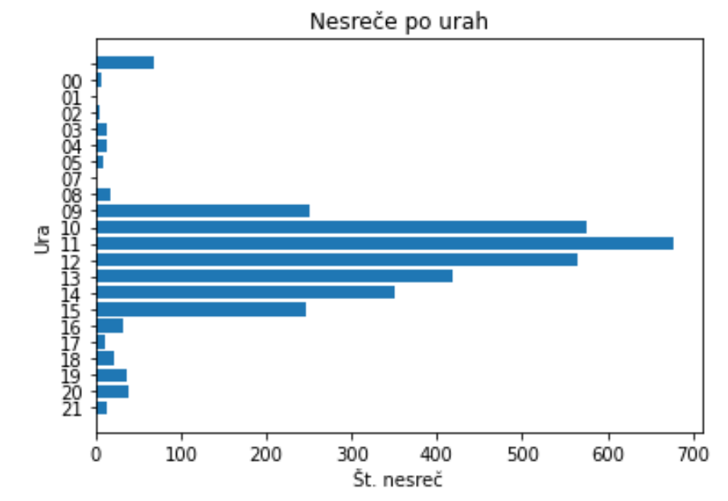
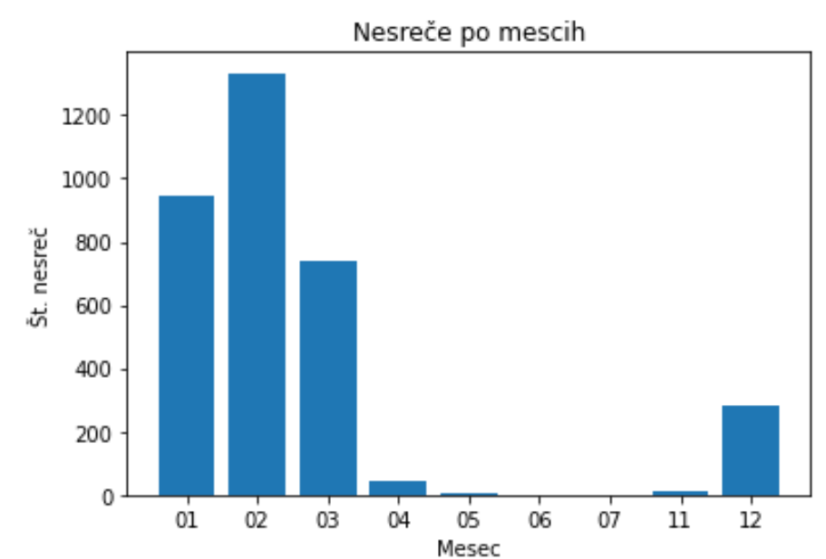
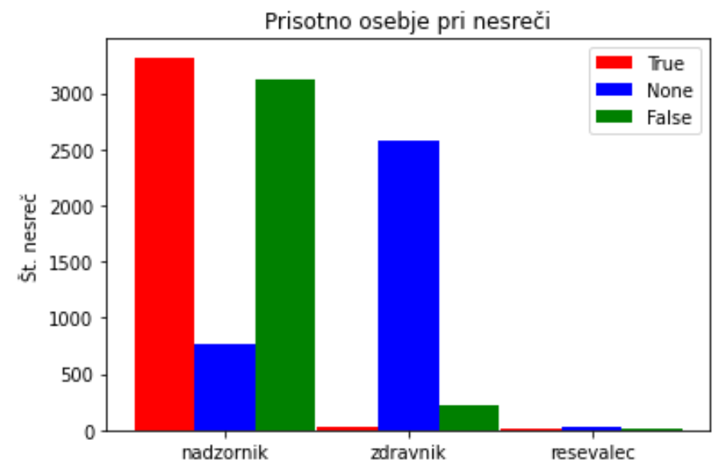
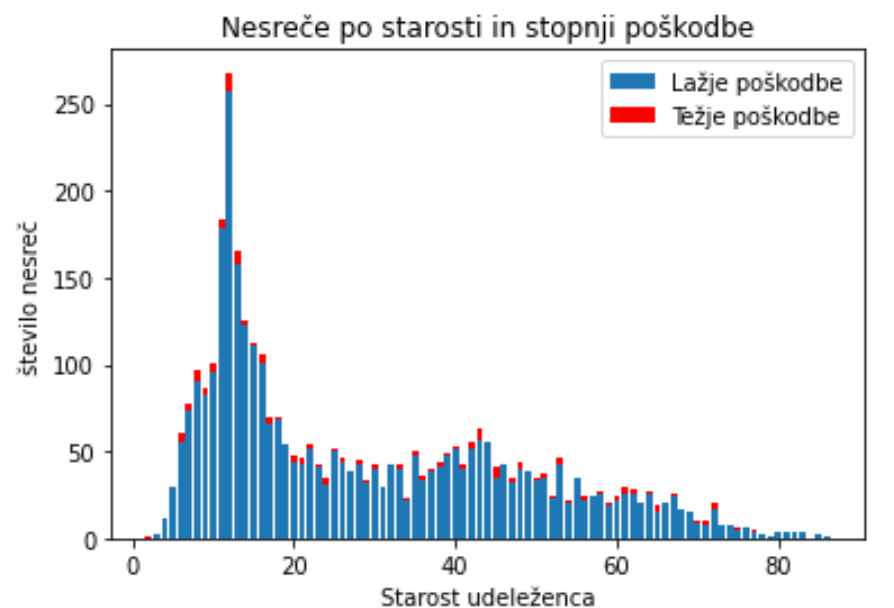

# PR21DPZM

Vsako leto se v smučarski sezoni zgodi veliko nesreč, zato bova poskušala podatke o preteklih nesrečah analizirati in ugotoviti, kateri so ključni razlogi za nastanek nesreče, kakšne so najpostejše posledice, kakšni so bili pogoji smučanja in podobno.

## Podatki

Podatke sva našla na spletni strani podatki.gov.si. Ker so nama datoteke CSV bolj domače od PCAXIS sva se odločila za te, čeprav je to precej zmanjšalo najino izbiro. Datoteka obsega podrobne informacije o nesrečah na slovenskih smučiščih za leta od 2013 do vključno 2017.

V podatkih je 23 atributov, to so oznaka zadeve, različne okoliščine nesreče (ura, veter, vreme...), podatki o udeležencih in drugo. Med podatki je veliko napak in manjkajočih vrednosti, zato bo te težave potrebno najprej odpraviti.

Določenim podatkom manjkajo vrednosti, ali pa so po nepotrebnem dodane. Nekaterim letom na primer manjka vodilna števka (983 namesto 1983), nekateri pa imajo vrednosti dodane, npr. '4 s snegom povsem pokrito smučišče' in 's snegom povsem pokrito smučišče' sta dve vrsti snega, čeprav gre za isto stvar. Te in podobne težave je potrebno odpraviti. Ko sva storila to, sva se lahko lotila raziskovanja.

## Atributi
V podatkih je skupno 23 atributov, to so:
1. Številka zadeve
2. Datum nesreče
3. Ura nesreče
4. Nadzornik prisoten
5. Zdravnik prisoten
6. Reševalec prisoten
7. Udeleženec A – LETO ROJSTVA
8. Udeleženec A – država
9. Udeleženec A – zvrst smučanja
10. Udeleženec A – ravnanje pred nesrečo
11. Udeleženec B – leto rojstva
12. Udeleženec B – država
13. Udeleženec B – zvrst smučanja
14. Udeleženec B – ravnanje pred nesrečo
15. Skica nesreče
16. Fotografija kraja nesreče
17. Posnetek kraja nesreče
18. Vreme
19. Vidljivost
20. Temperatura
21. Vrsta snega
22. Veter
23. Telesna poškodba

Kot napisano zgoraj, vsak je shranjen z svojo zaporedno številko, začnejo se še z veliko začetnico in vsebujejo tudi šumnike in druge znake, zato sva najprej te pretvorila v utrezno obliko. Odstranila sva zaporedno številko atributa, ime pretvorila v male črke ter zamenjala presledke s podčrtaji.

## Nesrece glede na datum in uro

Za prvi graf sva prikazala nesreče po mesecih in kot pričakovano je največje število nesreč ravno v zimskih časih. 

Za drugi graf sva te nesreče še razporedila glede na uro, ko se je nesreča zgodila in je pokazal, da se večina nesreč zgodi med deveto uro zjutraj in četrto popoldne, ko so odprta smučišča.

## Poškodbe in prisotnost osebja

Zdaj ko veva kdaj se je večina nesreč zgodila, so naju zanimale okoliščine nesreče, torej, ali je bilo prisotno osebje, ki bi lahko ob dogodku ustrezno ukrepalo. V naslednjem grafu se vidi, da je bila prisotnost osebja precej slaba. Nadzornik je namreč bil prisoten v približno polovici primerov, medtem ko zdravnik in reševalec nista skoraj nikoli oz. za zdravnika se ne ve, ali je bil ali ne.

Kar se tiče poškodb, je razvidno, da je večina poškodb lažjh in v vsakem starostnem obdobju. Največ nesreč pa se zgodi mladim udeležencem saj še nimajo veliko izkušenj in so bolj nepremišljeni.

## Vpliv temperature na število nesreč

Zanimalo naju je kakšen vpliv ima temperatura na pogostost nesreč. Iz grafa je razvidno, da je ta vpliv minimalen. Pričakovala sva, da bo temperatura imela večji vpliv na število nesreč. 

## Napovedovanje trenda

Znimalo naju je tude, kako bi se naj število nesreč spreminjalo v prihodnosti. Model napoveduje zelo majhne spremembe v številu nesreč na dan. Število nesreč naj nebi raslo v prihodnosti. Napoveduje vrednosti za približno 100 dni naprej.

